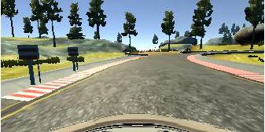

**Behavioral Cloning Project**

The goals / steps of this project are the following:
* Use the simulator to collect data of good driving behavior
* Build, a convolution neural network in Keras that predicts steering angles from images
* Train and validate the model with a training and validation set
* Test that the model successfully drives around track one without leaving the road
* Summarize the results with a written report


[//]: # (Image References)

[image1]: ./examples/placeholder.png "Model Visualization"
[image2]: ./examples/placeholder.png "Grayscaling"
[image3]: ./examples/placeholder_small.png "Recovery Image"
[image4]: ./examples/placeholder_small.png "Recovery Image"
[image5]: ./examples/placeholder_small.png "Recovery Image"
[image6]: ./examples/placeholder_small.png "Normal Image"
[image7]: ./examples/placeholder_small.png "Flipped Image"

## Rubric Points
###Here I will consider the [rubric points](https://review.udacity.com/#!/rubrics/432/view) individually and describe how I addressed each point in my implementation.  

---
###Files Submitted & Code Quality

####1. Submission includes all required files and can be used to run the simulator in autonomous mode

My project includes the following files:
* model.py containing the script to create and train the model
* drive.py for driving the car in autonomous mode
* model.h5 containing a trained convolution neural network 
* writeup_report.md or writeup_report.pdf summarizing the results

####2. Submission includes functional code
Using the Udacity provided simulator and my drive.py file, the car can be driven autonomously around the track by executing 
```sh
python drive.py model.h5
```

####3. Submission code is usable and readable

The model.py file contains the code for training and saving the convolution neural network. The file shows the pipeline I used for training and validating the model, and it contains comments to explain how the code works.

###Model Architecture and Training Strategy

####1. An appropriate model architecture has been employed

My model is based on the "NVDIA" convolution neural network consisting of three 5x5 and two 3x3 filter sizes and depths between 24 and 64 (model.py lines 156-160). Along with fully connected layers of 100, 50, and 10, with an output layer of 1 (model.py lines 162-165). 

The data is normalized in the model using a Keras lambda layer (code line 151) and is the top 70 and bottom 25 pixels are cropped to force the model learn the data that is most pertinent.

####2. Attempts to reduce overfitting in the model

I tried dropout layers in order to reduce overfitting but it only seemed to make it perform worse so I left it out. 

The model was trained and validated on different data sets to ensure that the model was not overfitting (code line 76). The model was tested by running it through the simulator and ensuring that the vehicle could stay on the track.

Looking at the training vs validation loss the model did not show it was overfitting.


####3. Model parameter tuning

The model used an adam optimizer, so the learning rate was not tuned manually (model.py line 169).  10 epochs seem to do well for this model.  Bumping the side image steering angle by +-0.25 seemed to do well.

####4. Appropriate training data

Training data was chosen to keep the vehicle driving on the road. I used a combination of center lane driving, recovering from the left and right sides of the road. Also did extra training around the curves (with some extra training for the right hand curve), bridge, and the dirt road corner just after the bridge.  I also used the left and right cameras with a bump to the steering angle to help recovery. 

For details about how I created the training data, see the next section. 

###Model Architecture and Training Strategy

####1. Solution Design Approach

The overall strategy for deriving a model architecture was to ...

My first step was to use a convolution neural network model similar to the NVDIA model. I thought this model might be appropriate because it was recommended by David Silver in the youtube video.  Also, it was said that this model performs especially well for driving applications.

In order to gauge how well the model was working, I split my image and steering angle data into a training and validation set. I tried a very basic model with just the pre-packaged data (data.zip) at first and ran it on the simulater and it did terrible.  I kept adding more training data but it still did not help so I tried the suggested NVDIA model which did much better so now I had a base to work from.
There were a few spots where the vehicle fell off the track on the bridge, the dirt corner, and the right hand curve. To improve the driving behavior in these cases, I trained more data on those specific areas which resolved many of the issues.  It seemed though, that when I would train to fix one area (for example on the right hand curve) it would "break" another area (like the bridge).  Through trial and error I finally found a combination of data that worked.

At the end of the process, the vehicle is able to drive autonomously around the track without leaving the road.

####2. Final Model Architecture

The final model architecture (model.py lines 18-24) consisted of a convolution neural network with the following layers and layer sizes ...

| Layer         		|     Description	        					| 
|:---------------------:|:---------------------------------------------:| 
| Input         		| 160x320x3 color image   							| 
| Normalization      		| divide by 255 and minus 0.5   							| 
| Cropping      		| Cropped off top 70 and bottm 25 pixels		| 
| Convolution 5x5     	| 2x2 stride, 24 deep 	|
| relu			 		|	Activation											|
| Convolution 5x5	   | 2x2 stride, 36 deep     |
| relu			 		|	Activation											|
| Convolution 5x5	   | 2x2 stride, 48 deep     |
| relu			 		|	Activation											|
| Convolution 3x3	   | 1x1 stride, 64 deep     |
| relu			 		|	Activation											|
| Convolution 3x3	   | 1x1 stride, 64 deep     |
| relu			 		|	Activation											|
| Fully connected		| Outputs 100        									|
| Fully connected		| Outputs 50					|
| Fully connected		| Outputs 10					|
| Output		| Outputs 1        									|

####3. Creation of the Training Set & Training Process

To get good driving behavior, I used the data.zip data supplied by the class. Looking at the images is appeared to have a few laps of driving clockwise and counter clockwise. Here is an example image of center lane driving:


I then recorded the vehicle recovering from the left side and right sides of the road back to center so that the vehicle would learn to get the right steering angle if positioned to run off the road. These images show what a recovery looks like starting from left to right :


Then I repeated this process for the first curve, dirt corner, and right hand curve.

To augment the data sat, I also flipped images and angles thinking that this would balance the data to get less of a bias because of training on mostly left hand turns. For example, here is an image that has then been flipped:





After the collection process, I had 45,939 number of data points. I then attempted to preprocess the data by blurring the image but seemed to have bad effects on my model so I did not use it.  The top 70 and bottom 25 pixels are cropped to simplify the image for training on only data that is necessary.  The images were also normalized and shifted around zero for improved calculations by the model.


I finally randomly shuffled the data set and put 20% of the data into a validation set. 

I used this training data for training the model. The validation set helped determine if the model was over or under fitting. The ideal number of epochs was 10 as evidenced by trial and error (See MSE loss graph above).  I used an adam optimizer so that manually training the learning rate wasn't necessary.
