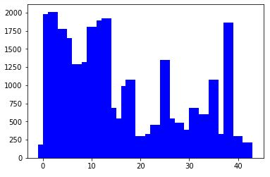
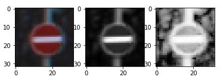
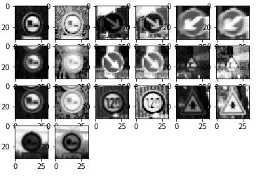
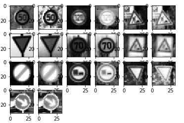
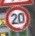
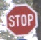
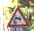
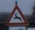
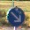

#**Traffic Sign Recognition** 

**Build a Traffic Sign Recognition Project**

The goals / steps of this project are the following:
* Load the data set (see below for links to the project data set)
* Explore, summarize and visualize the data set
* Design, train and test a model architecture
* Use the model to make predictions on new images
* Analyze the softmax probabilities of the new images
* Summarize the results with a written report

[//]: # (Image References)

[image1]: ./examples/visualization.jpg "Visualization"
[image2]: ./examples/grayscale.jpg "Grayscaling"
[image3]: ./examples/random_noise.jpg "Random Noise"
[image4]: ./examples/placeholder.png "Traffic Sign 1"
[image5]: ./examples/placeholder.png "Traffic Sign 2"
[image6]: ./examples/placeholder.png "Traffic Sign 3"
[image7]: ./examples/placeholder.png "Traffic Sign 4"
[image8]: ./examples/placeholder.png "Traffic Sign 5"

## Rubric Points
###Here I will consider the [rubric points](https://review.udacity.com/#!/rubrics/481/view) individually and describe how I addressed each point in my implementation.  

---
###Writeup / README

####1. Provide a Writeup / README that includes all the rubric points and how you addressed each one. You can submit your writeup as markdown or pdf. You can use this template as a guide for writing the report. The submission includes the project code.

You're reading it! and here is a link to my [project code](https://github.com/gjm222/udacity-projects/blob/master/writeup_project2.md)

###Data Set Summary & Exploration

####1. Provide a basic summary of the data set and identify where in your code the summary was done. In the code, the analysis should be done using python, numpy and/or pandas methods rather than hardcoding results manually.

The code for this step is contained in the second code cell of the IPython notebook.  

I used the numpy library to calculate summary statistics of the traffic
signs data set:

* The size of training set is 34799
* The size of test set is 12630
* The shape of a traffic sign image is (32, 32, 3)
* The number of unique classes/labels in the data set is 43

####2. Include an exploratory visualization of the dataset and identify where the code is in your code file.

The code for this step is contained in the third code cell of the IPython notebook.  

Here is an exploratory visualization of the data set. It is a bar chart showing how the data is distributed for each class:

###Design and Test a Model Architecture

####1. Describe how, and identify where in your code, you preprocessed the image data. What tecniques were chosen and why did you choose these techniques? Consider including images showing the output of each preprocessing technique. Pre-processing refers to techniques such as converting to grayscale, normalization, etc.

The code for this step is contained in the fourth code cell of the IPython notebook.

As a first step, I decided to convert the images to grayscale it would eliminate color as a training factor and would make it concentrate on shapes, lines, etc. I also used a histogram function on all the images to even out the contrast so that darkness or lightness of the image would be less of a factor.

Here is an example of a traffic sign image before and after grayscaling and histogram processing.

Here is an example of a traffic sign image before and after histogram processing on grayscale image.

I also ran the images through a gaussian smoothing function to even the features out more.
Here is an example of a traffic sign image before and after full preprocessing of grayscale image which includes the smoothing of the image.

As a last step, I normalized and zero-centered the image data because in puts the input values in comparable range which is to avoid some of the incorrect computations that can happen on very large and very small numbers.  

####2. Describe how, and identify where in your code, you set up training, validation and testing data. How much data was in each set? Explain what techniques were used to split the data into these sets. (OPTIONAL: As described in the "Stand Out Suggestions" part of the rubric, if you generated additional data for training, describe why you decided to generate additional data, how you generated the data, identify where in your code, and provide example images of the additional data)

The splitting of data into training, validation, and testing data was already done. So, this code just loads the data in cell one.

My final training set had 32799 number of images. My validation set and test set had 4410 and 12630 number of images.

####3. Describe, and identify where in your code, what your final model architecture looks like including model type, layers, layer sizes, connectivity, etc.) Consider including a diagram and/or table describing the final model.

The code for my final model is located in the ninth cell of the ipython notebook. 

My final model consisted of the following layers:

| Layer         		|     Description	        					| 
|:---------------------:|:---------------------------------------------:| 
| Input         		| 32x32x1 grayscale image   							| 
| Convolution 9x9     	| 1x1 stride, valid padding, outputs 24x24x6 	|
| ELU			 		|	Activation											|
| Max pooling	      	| 2x2 stride,  outputs 12x12x6 				|
| Convolution 5x5	   | 1x1 stride, valid padding, outputs 8x8x16    |
| RELU6	 		|	Activation									|
| Max pooling	      	| 2x2 stride,  outputs 4x4x16 				|
| Fully connected		| Input 256, outputs 120        									|
| Sigmoid				| Activation        									|
| Fully connected		| Input 120, outputs 84        									|
| RELU						|	Activation											|
|	Dropout					| 75%											|
| Output		| Input 84, outputs 43        									|
 

####4. Describe how, and identify where in your code, you trained your model. The discussion can include the type of optimizer, the batch size, number of epochs and any hyperparameters such as learning rate.

The code for training the model is located in the eleventh cell of the ipython notebook. 

To train the model, I used an AdamOptimizer, batch size of 300, and number of epochs of 20.

####5. Describe the approach taken for finding a solution. Include in the discussion the results on the training, validation and test sets and where in the code these were calculated. Your approach may have been an iterative process, in which case, outline the steps you took to get to the final solution and why you chose those steps. Perhaps your solution involved an already well known implementation or architecture. In this case, discuss why you think the architecture is suitable for the current problem.

The code for calculating the accuracy of the model is located in the ninth cell of the Ipython notebook.

My final model results were:
* training set accuracy of .985
* validation set accuracy .935  
* test set accuracy of .899

If an iterative approach was chosen:
* What was the first architecture that was tried and why was it chosen?  
 * The first architecture of a regular LeNet was chosen because it was recomended by the instructor who explained that it was good for signs. 
* What were some problems with the initial architecture?  
 * The accuracy was around 75-80%.  It seemed to have too simple of activations to fit the data.
* How was the architecture adjusted and why was it adjusted? 
 * I tried a few LeNet structures like using an initial 3x3 filter to initialy capture small features. I also tried an initial 9x9 filter to find that it actually worked better than both the regular LeNet and the 3x3.  I also tried different activations randomly which helped the accuracy a lot.  Along with pooling and dropout to avoid overfitting.  
* Which parameters were tuned? 
 * The batch size to 300 and number of epochs to 20. Changing learning rate did not seem to gain much. Changing the initial randomizing of the weights with a normal distribution of standard deviation of .1 and mean of 0 above or below the current values degraded results.  
* How were they adjusted and why?  
 * All the parameters were adjusted above and below and exaimined if they improved results.  I admit I adjusted them not expecting it to improve or not.
* What are some of the important design choices and why were they chosen? For example, why might a convolution layer work well with this problem? 
 * The two most important design choices were the grayscaling and normalizing of the image, changing of the activations and the number of epochs.  How might a dropout layer help with creating a successful model?  The dropout kept helped with overfitting and also seemed to keep the learning going.  Before adding dropout, the learning would peak earlier and not learn any more.

If a well known architecture was chosen:
* What architecture was chosen? 
 * LeNet with a 9x9 initial filter.
* Why did you believe it would be relevant to the traffic sign application? 
 * I did because it was recommended by the instructor and we were learning it up to this point.
* How does the final model's accuracy on the training, validation and test set provide evidence that the model is working well?
 * It showed almost 100% accuracy on the set it trained on and the test and validation results were very close to each other so over and under fitting did not seem to be a problem. 
 

###Test a Model on New Images

####1. Choose five German traffic signs found on the web and provide them in the report. For each image, discuss what quality or qualities might be difficult to classify.

Here are five German traffic signs that I found on the web:

   
 

The first image might be difficult to classify because it looks like many other circled numbered signs. It also has a piece of another sign above it.

The second image might be difficult to classify because it looks like many other circled signs especially since color is not used to learn these images.

The third and fourth images might be difficult to classify because it they look so much a like in every way. The fourth image is seems to be very dark which the greyscale and histogram functions should have somewhat corrected.

The last images may not be difficult to classify but is extremely important to get correct.

####2. Discuss the model's predictions on these new traffic signs and compare the results to predicting on the test set. Identify where in your code predictions were made. At a minimum, discuss what the predictions were, the accuracy on these new predictions, and compare the accuracy to the accuracy on the test set (OPTIONAL: Discuss the results in more detail as described in the "Stand Out Suggestions" part of the rubric).

The code for making predictions on my final model is located in the tenth cell of the Ipython notebook.

Here are the results of the prediction:

| Image			        |     Prediction	        					| 
|:---------------------:|:---------------------------------------------:| 
| 20 km/h     			| 20 km/h 										|
| Keep right					| Keep right											|
| Slippery Road			| Slippery Road      							|
| Wild Animal Crossing | Wild Animal Crossing	|
| Stop Sign      		| Stop sign   									| 

The model was able to correctly guess 5 of the 5 traffic signs, which gives an accuracy of 100%. This compares favorably to the accuracy on the test set of 89.8%.

####3. Describe how certain the model is when predicting on each of the five new images by looking at the softmax probabilities for each prediction and identify where in your code softmax probabilities were outputted. Provide the top 5 softmax probabilities for each image along with the sign type of each probability. (OPTIONAL: as described in the "Stand Out Suggestions" part of the rubric, visualizations can also be provided such as bar charts)

The code for making predictions on my final model is located in the 19th cell of the Ipython notebook. Note that the probabilities are all small because of large negative values in my logits.

For the first image, the model is not that sure that this is a 20 km/h sign (probability of 0.10 vs 0.08 of the next sign), which is the correct choice. Probably getting confused with the other km/h signs The top five soft max probabilities were:

| Probability         	|     Prediction	        					| 
|:---------------------:|:---------------------------------------------:| 
| .10         			|  20 km/h  									| 
| .08     				|  30 km/h 						|
| .06					| 120 km/h 										|
| .06	      			| 70 km/h				 				|
| .04				     | Roundabout mandatory   							|

For the second image, the model is relativley sure that this is a keep right sign (probability of 0.10 vs 0.04 of the next sign), which is the correct choice. The top five soft max probabilities were:

| Probability         	|     Prediction	        					| 
|:---------------------:|:---------------------------------------------:| 
| .10     				| Keep right											|
| .04         			| End of all speed and passing limits  									| 
| .04					| Turn left ahead 										|
| .04	      			| Go straight or right				 				|
| .04				    | No passing for vehicles over 3.5 metric tons   							|

For the third image, the model is not totally sure that this is a slippery road sign (probability of 0.11 vs 0.09 of the next sign), which is the correct choice. The top five soft max probabilities were: 

| Probability         	|     Prediction	        					| 
|:---------------------:|:---------------------------------------------:| 
| .11					|Slippery Road 										|
| .09         			| 50km/h 								| 
| .05     				|  Beware of ice/snow									|
| .05	      			| Dangerous curve to the right			 				|
| .05				    | Road work   							|

For the fourth image, the model is relatively sure that this is a wild animals crossing sign (probability of 0.10 vs 0.06 of the next sign), which is the correct choice. The top five soft max probabilities were: 

| Probability         	|     Prediction	        					| 
|:---------------------:|:---------------------------------------------:| 
| .10         			| Wild animals crossing 									| 
| .06     				| Double curve									|
| .06					| Dangerous curve to the left						|
| .05	      			| Bicycles crossing		 				|
| .05				    | Road work							|

For the fifth image, the model is relatively sure that this is a stop sign sign (probability of 0.09 vs 0.05 of the next sign), which is the correct choice. The top five soft max probabilities were:  

| Probability         	|     Prediction	        					| 
|:---------------------:|:---------------------------------------------:| 
| .09         			| Stop sign 									| 
| .05     				| Keep right									|
| .04					| No vehicles				|
| .04	      			| No entry			 				|
| .03				    | Bumpy road				|
